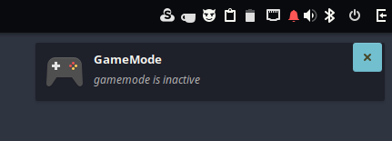

# Gamemode Status
Get notified when gamemode is running, This is a basic script that calls "gamemodded -s" for current gamemode status and uses notify-send to notify user

## Requirements
gamemode, python

## Usage
```shell
$ chmod +x GamemodeStatus.py
$ GamemodeStatus.py
```
 **Optional** - copy GamemodeStatus.py to your bin folder location /bin or ~/bin and add to AutoStart command ``` GamemodeStatus.py & ```

## Screenshot


## TODO
* Add some error handling
* Tidy up code
* Decide if I will make it into a budgie applet and include options or a simple daemon